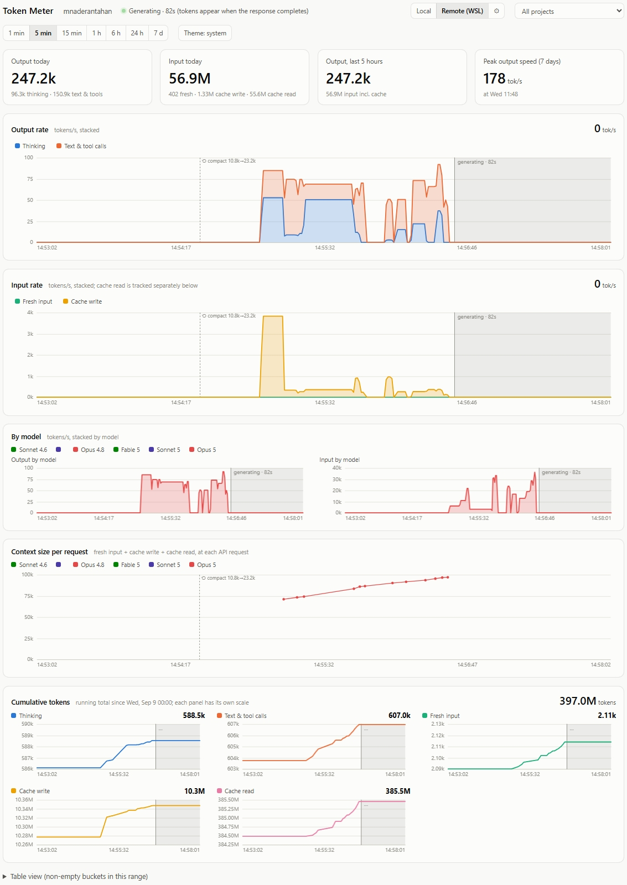

# Token Meter

A live, Task-Manager-style dashboard of your Claude Code token usage — across every
project, and, via the Local/Remote toggle, across a WSL install running alongside
Windows.



It reads the
transcripts Claude Code already writes to `~/.claude/projects/**/*.jsonl`, so it costs
no tokens and needs nothing beyond Python 3.8+ (standard library only). Works on Windows, Linux
and macOS.

```
python token_meter.py            # opens http://127.0.0.1:8765/
python token_meter.py --no-browser --port 9000
```

Options: `--projects <dir>` (repeatable; defaults to `$CLAUDE_CONFIG_DIR/projects` or
`~/.claude/projects`) — pass it more than once to merge several Claude Code
`projects` folders into one meter, `--interval <s>` transcript poll interval,
`--host`.

## What you see

- **Output rate**: thinking and text/tool-call tokens per second, stacked.
- **Input rate**: fresh input and cache writes per second, stacked. Cache read is
  left out of this chart — it re-counts the whole context every turn and would
  dwarf everything else; it's still in the cumulative panel and in the total
  context size on the per-request chart below.
- **By model**: output and input rate, stacked by model instead of by token type.
  Only shown once a second model has actually been used (e.g. after switching with
  `/model`); each model gets a fixed color for the life of the page.
- **Context size per request**: one point per API request — fresh input + cache
  write + cache read, i.e. everything sent as the prompt for that call — colored by
  model. This is the chart to watch for what `/compact` or a model switch actually
  did to your context size, request by request.
- **Cumulative tokens**: a running total counted from local midnight 7 days ago, so
  every range shows the same totals. There's one small panel per token type, and each
  panel's y-axis fits the values in view, so a 1-minute climb is visible even when
  the total is in the millions.
- Markers on the rate and context-size charts for session starts, `/model`,
  `/compact` (with the before/after token counts) and `/clear`.
- Tiles for today, the last 5 hours, and the 7-day peak output speed; a table view of
  the buckets.
- **Project filter**: a dropdown next to the range picker scopes every chart, the
  requests scatter and the event markers to one Claude Code project (i.e. one cwd a
  session was launched from). Defaults to "All projects".
- **Local / Remote (WSL) source toggle**: if you also run Claude Code inside WSL,
  its transcripts live under WSL's own `~/.claude/projects` — invisible to a meter
  running natively on Windows. Rather than have one meter poll both filesystems
  (slow, over `\\wsl.localhost\...`), run a second, lightweight meter *inside* WSL
  and point this toggle at it (guesses `http://localhost:8766`; click the ⚙ to
  change it). Clicking **Remote** when nothing answers there offers to start it for
  you — the Windows meter runs `wsl.exe` to launch its WSL counterpart, but only
  after showing the exact command in a confirm dialog, and only relaunches
  something it isn't already tracking as running. A meter it started this way is
  stopped again when the Windows meter shuts down; one you started by hand is left
  alone either way.

Ranges: 1 min / 5 min (1 s buckets), 15 min (5 s), 1 h (10 s), 6 h (1 min),
24 h (5 min), 7 d (30 min). Totals cover every project for the current OS user and
source, or one project if you've picked one from the dropdown.

## How the numbers are derived

- Claude Code logs one transcript entry per content block (thinking, text, tool call),
  and every entry repeats the response's final `usage`. Responses are counted once
  by message id, so resumed sessions that copy history don't double count either.
- Usage is only reported when a response block is written, not while it streams.
  Each response's tokens are spread evenly from the prompt or tool result that
  triggered it to its last block (capped at 300 s). Nothing about a response reaches
  the transcript until it is complete, so its tokens appear after it finishes.
- While a request is in flight (a prompt or tool result was written but no response
  yet), the charts shade that period as "generating" and the header shows a live
  timer; "Running tool" is shown while Claude Code executes a requested tool.
- `thinking_tokens` comes from `usage.output_tokens_details`; "Text & tool calls" is
  the rest of `output_tokens`.
- Each response's `message.model` is what drives the by-model split; a model is
  colored in the order it was first used (across all projects, within the retention
  window below), never reassigned.
- A session-start marker is the first line of a transcript file; `/model` and
  `/clear` come from the `<command-name>` the transcript logs for a slash command;
  `/compact` (manual or automatic) comes from the `compact_boundary` entry Claude
  Code writes, which also carries the pre/post token counts shown on hover.
- History is kept in memory only: per-second buckets for 2 hours and per-minute
  buckets for 8 days, rebuilt from the transcripts at startup.
