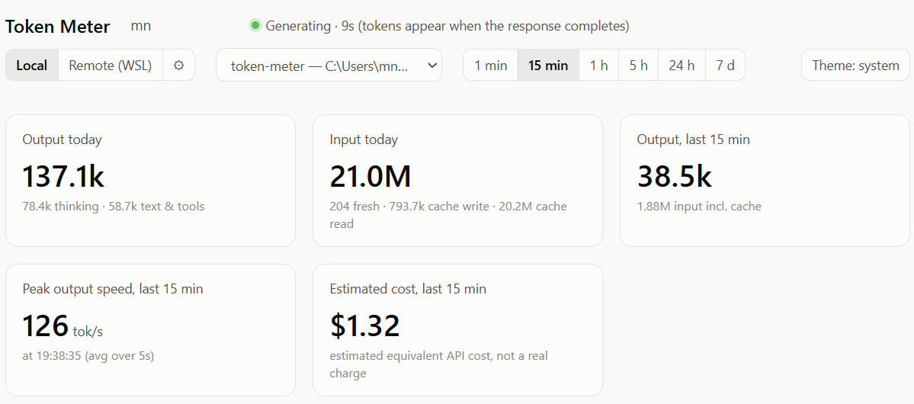
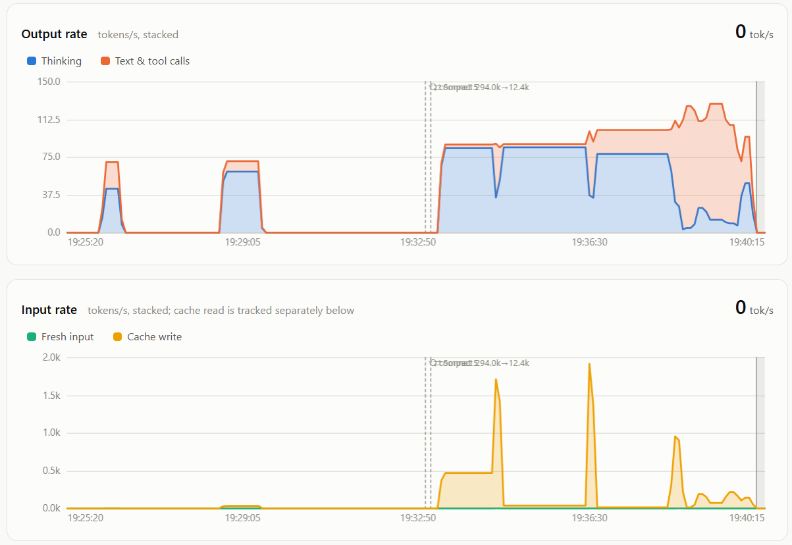
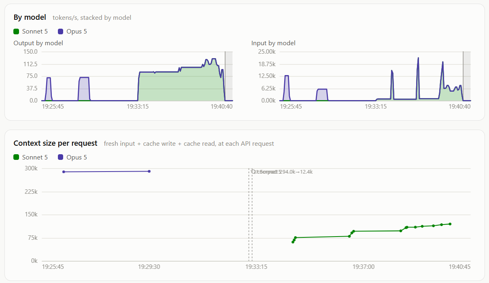
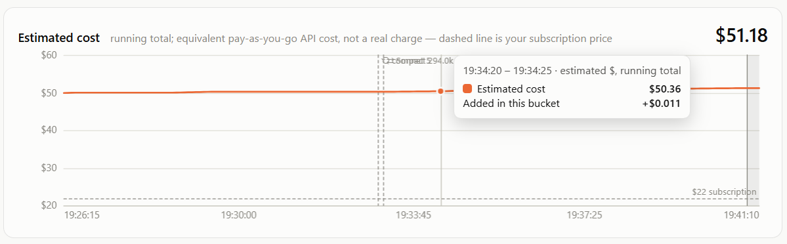
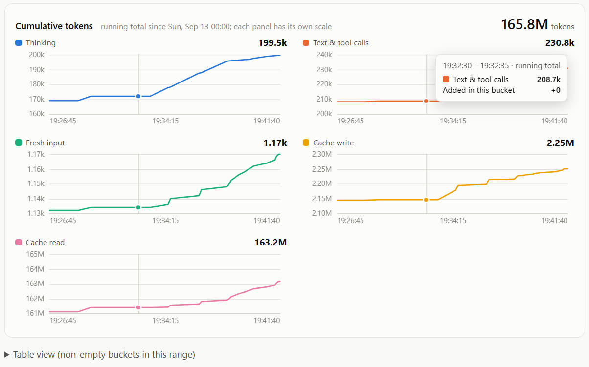

# Token Meter

A live, Task-Manager-style dashboard of your Claude Code token usage — across every
project, and, via the Local/Remote toggle, across a WSL install running alongside
Windows.



It reads the transcripts Claude Code already writes to `~/.claude/projects/**/*.jsonl`,
so it costs no tokens, makes no network calls, and needs nothing beyond Python 3.8+
(standard library only). Works on Windows, Linux and macOS.

```
python token_meter.py            # opens http://127.0.0.1:8765/
python token_meter.py --no-browser --port 9000
```

Options: `--projects <dir>` (repeatable; defaults to `$CLAUDE_CONFIG_DIR/projects` or
`~/.claude/projects`) — pass it more than once to merge several Claude Code
`projects` folders into one meter, `--interval <s>` transcript poll interval,
`--host`, `--port`, `--no-browser`, `--subscription-price <dollars>` (default `22`)
for the estimated-cost chart's reference line.

## Reading the dashboard

### First, what a "token" means here

Every response Claude Code gets back reports five kinds of tokens, and the dashboard
keeps them apart because they mean very different things:

| Kind | What it is | Why you'd care |
|---|---|---|
| **Thinking** | Tokens Claude spent reasoning before answering | Output; billed and rate-limited like any output |
| **Text & tool calls** | The reply text and the tool calls Claude wrote | Output |
| **Fresh input** | New prompt tokens that weren't already cached | Input you're paying full price for |
| **Cache write** | Prompt tokens stored in Claude's cache for reuse | Costs a bit more than fresh input, but pays off if reused |
| **Cache read** | Prompt tokens served from the cache | Very cheap, but it re-counts your *whole* context on every turn, so the number gets huge |

Each turn, Claude re-reads your entire conversation. Ideally most of that comes from
cache (cache read, cheap) rather than being rewritten (cache write) or sent fresh.

### The header

- **Status** (next to your user name): `Generating… 12s` while a request is in flight,
  `Running tool` while Claude Code executes a tool Claude asked for, otherwise `Idle`
  with the time since the last response. Tokens for a response only appear once it has
  *finished* — Claude Code doesn't log usage while it streams — so during a long
  response the charts stay flat and then fill in when it lands.
- **Local / Remote** (see [below](#local--remote-wsl-source-toggle)), **project
  filter**, **time range**, an **Update** button, and a theme button.
- **Project filter**: scopes every card to one Claude Code project (one folder you
  launched a session from). Defaults to "All projects". Useful for answering "which
  project is actually burning tokens?".
- **Time range** — `1 min`, `15 min`, `1 h`, `5 h`, `24 h`, `7 d` — sets how much history
  the charts show (and how coarse each bar is: 1 s, 5 s, 10 s, 1 min, 5 min, 30 min).
  `5 h` matches the length of Claude's session rate-limit window, so it shows
  everything that happened inside one. Three of the tiles follow the range too (see
  below); the two "today" tiles and the cumulative totals don't.

### Hints and warnings

A banner appears above the tiles only when it's worth interrupting you:

- **Context is filling up** — amber at 70%, red at 90% of the model's context window,
  measured on your most recent request. A big context makes every turn slower and more
  expensive; run `/compact` to summarize it, or `/clear` to start fresh.
- **Cache is being rewritten often** — in the last 15 minutes, far more tokens were
  written to cache than read back from it. That usually means you're switching models
  (`/model`) or clearing (`/clear`) a lot: each switch forces the whole context to be
  cached again from scratch. Staying on one model within a session lets the cache pay
  off.
These are rules of thumb built from your own numbers, not Claude's own alerts. The
context limits come from a `CONTEXT_LIMITS` table baked into `token_meter.py`, set to
1M tokens (Claude Code's long-context mode) — edit it there if Anthropic changes a
window or your account uses the smaller 200k one, in which case you'd want the warning
sooner. If a request is ever larger than its model's listed window, the table is out of
date rather than you being in trouble, so the hint stays quiet instead. (The banner
in the screenshot at the top was taken against a 200k window, which is what you'd see
after editing the table down.)

### The tiles

The five tiles at the top are quick totals for the selected project and source. The
first two are always "today"; the other three follow the time range you picked, so the
label changes with it (e.g. "Output, last 1 h") and they always describe the same
window the charts below are showing.

- **Output today** — thinking + text/tool-call tokens since local midnight, with the
  split underneath.
- **Input today** — fresh input + cache write + cache read since local midnight. Expect
  this to be much bigger than output, mostly cache read.
- **Output, last *range*** — output tokens in the selected range (plus input including
  cache underneath). With `5 h` selected this is a handy companion to Claude's own
  `/usage`, but note it's a rolling window ending now — Claude's real session window
  starts at your first message.
- **Peak output speed, last *range*** — the highest output rate in the selected range
  (tokens per second), with when it happened. It's the tallest point of the Output rate
  chart, so on longer ranges, where each bar averages a minute or more, it reads lower
  than a short burst really was; the tile notes the averaging period.
- **Estimated cost, last *range*** — see [Estimated cost](#estimated-cost).

### Output rate

Thinking and text/tool-call tokens **per second**, stacked, over the selected range. The
number at the top right is the current rate. Use it to see *when* Claude is working and
how much of that is thinking versus writing. A shaded band means a request is in
flight right now. Click a name in the legend to hide it; hover for exact values at a
point in time.

Because Claude Code only logs usage when a response completes, each response's tokens
are spread evenly across the time it took (from your prompt or tool result to the end
of the response, up to 5 minutes). So the shape shows roughly when work happened, not
exact token-by-token timing.



The dashed `⇄ Opus 5` line is a `/model` switch. Note what the lower chart does there:
a burst of cache writes, because the new model has to cache the conversation again.

### Input rate

Fresh input and cache-write tokens per second, stacked. **Cache read is left out** of
this chart on purpose: it re-counts the whole context every turn and would dwarf
everything else. A healthy session mostly shows small fresh-input and cache-write
bumps; a lot of cache write (see the churn hint) usually points to model switches or
`/clear` — the spike in the screenshot above is exactly that. Cache read is still
counted in the cumulative panels and in the context size below.

### By model

Output and input rate again, but stacked by **model** instead of by token type. This
card only appears once you've used more than one model in the last 8 days (for example
after `/model`); a model you haven't touched in that long drops off the list. Each model
keeps the same color everywhere — in both charts here, on the context-size chart,
whichever project you have selected, and across relaunches (color is fixed by model
family, not by the order you've used them in). There are five model colors; a sixth
model or more shares grey rather than repeating a color, until a newer build adds it
its own slot — see [Keeping it up to date](#keeping-it-up-to-date). Use it to see
how much each model contributed — for example, how much work happened on Opus (planning) versus Sonnet
(executing).



### Context size per request

One point per API request, showing how big the prompt was for that call — fresh input +
cache write + cache read — colored by model. This is the chart to watch for:

- **A steady climb** — your context is growing; time to think about `/compact`. (The
  context warning above is driven by the last point on this chart.)
- **A sudden drop** — a `/compact` or `/clear` did its job.
- **A spike after `/model`** — switching models means the new model has no cache of
  your conversation, so the whole context gets written again.

Dashed vertical markers show session starts, `/model` switches, `/compact` (labeled
with the token count before → after) and `/clear`, so you can tie a change in size to
what caused it. It's the lower chart in the screenshot above: each model's points climb
steadily as the conversation grows, and the color changes at the switch.

### Estimated cost

A running total of what your usage would have cost at metered **pay-as-you-go API
pricing**, computed per model. The dashed line is your subscription price
(`--subscription-price`, default `$22`).

**This is not a bill.** A Claude Pro/Max subscription isn't charged per token — it
gives you rate-limited usage for a flat fee. This chart answers a different question:
"roughly how much API-equivalent value am I getting for that flat price?" When the
line is above the dashed one, you've used more than the subscription's price in
API-equivalent terms.

**Where do the prices come from, and do I have to keep them up to date?** No. The meter
starts from a built-in price table (`PRICING` in `token_meter.py`) and then checks it
against Claude Code's own accounting: Claude Code prices every session with the rates
built into its release and writes the result into your transcripts, so those records
always carry the *current* prices. For each model, the meter scales its prices to match.
When Anthropic changes a price and your Claude Code updates, the estimate follows on its
own — nothing to edit, nothing to download, no network call. A model the table has never
heard of is priced from the same records instead of showing $0.

A line under the chart says what happened for each model:

- **confirmed** — the built-in prices already matched Claude Code's figures (within 3%).
- **corrected** (e.g. `Sonnet 5 ×1.30`) — they didn't, and the estimate was adjusted by
  that factor.
- **priced from Claude Code's cost records** — the model isn't in the built-in table at
  all.
- **built-in table prices, no records to check them against** — Claude Code hasn't
  recorded at least $1 of usage for that model in the last 8 days (a new install, a
  rarely used model, or an older Claude Code that doesn't write these records), so the
  table is used as is.
- **no known price, so counted as $0** — neither source knows the model.

How accurate is it? Over all the history on the machine this was built on, the built-in
table alone lands within 1% of Claude Code's own total (Opus about 2.5% high, all of it
from one session), and over the last week it matches exactly. The correction is one
factor per model, so totals agree with Claude Code's, but a stretch with an unusual mix —
a burst of cache writes, say — can be off by a little. After a price change the factor is
an average of old and new usage until the last 8 days are all at the new price.

Rough edges: web search is billed per request rather than per token and isn't counted.



### Cumulative tokens

Running totals, counted from local midnight seven days ago — so every time range shows
the same totals rather than restarting from zero. There is one small panel per token
type, each with its own scale that fits the values currently in view, so even a
one-minute climb is visible when the total is in the millions. The number at the top
right is the grand total.



The scales tell the story on their own: thinking and text in the hundreds of thousands,
cache read in the hundreds of millions.

### Table view

Expand it (bottom of the screenshot above) for the exact numbers behind the current
range: one row per non-empty time bucket, one column per token type. Handy for copying values out or when
a chart is too small to read precisely.

## Keeping it up to date

The **Update** button in the header runs `git pull` on this checkout — it shows you
the exact command first and only runs it once you confirm. This is the one thing in
Token Meter that makes a network call; everything else, including the estimated-cost
pricing, updates on its own from your local transcripts without ever needing an
update (see [Estimated cost](#estimated-cost)). What an update *does* still get you:
a newly released model gets its own legend color and context-window warning instead
of falling back to grey with no hint, once someone's added it to the two small
tables that need one.

- Changes to `dashboard.html` apply on your very next refresh, no restart needed.
- Changes to `token_meter.py` need you to restart it by hand — the button tells you
  when that's the case.
- Only works on a `git clone` of this repo with a clean fast-forward available; if
  you've made local edits, resolve that the normal `git` way first.

## Local / Remote (WSL) source toggle

If you also run Claude Code inside WSL, its transcripts live under WSL's own
`~/.claude/projects` — invisible to a meter running natively on Windows. Rather than
have one meter poll both filesystems (slow, over `\\wsl.localhost\...`), run a second,
lightweight meter *inside* WSL and point this toggle at it (it guesses
`http://localhost:8766`; click the ⚙ to change it).

Clicking **Remote** when nothing answers there offers to start it for you: the Windows
meter runs `wsl.exe` to launch its WSL counterpart, but only after showing you the exact
command in a confirm dialog. A meter it started this way is stopped again when the
Windows meter shuts down; one you started by hand is left alone either way.

## Good to know

- **What it can't show:** Claude's actual session and weekly rate-limit percentage.
  That lives on Anthropic's servers, and reading it would need a network call this tool
  deliberately never makes. Use `/usage` inside Claude Code (or the VS Code extension's
  usage bars) for the real number; the `5 h` range is the closest an offline tool can
  get, showing the same charts over that span.
- Resumed sessions that replay old history aren't double counted.
- Only Claude Code activity on this machine (this OS user, and the sources you've
  connected) is included — not claude.ai chat or usage from other devices.
- The server listens on `127.0.0.1` and answers cross-origin requests only from other
  pages on this machine, so a site you happen to have open in a browser can't read your
  usage or project paths. Pointing `--host` at a non-loopback address drops that
  protection for anything that can reach the port.
- History is kept in memory only (per-second detail for the last 2 hours, per-minute
  for 8 days) and rebuilt from your transcripts each time the meter starts, so
  restarting it loses nothing that's still in your transcript files.
